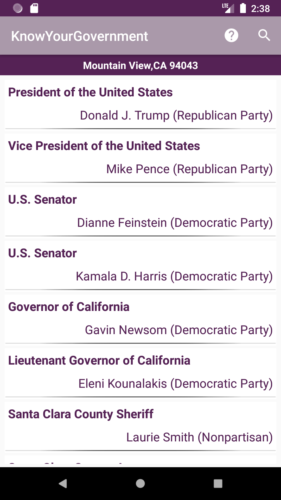

# Know Your Government App - JAVA

## Home Screen

## Detail Screen

## App Features:-

- This APP acquire and display an interactive list of political officials that represent the current location (or a specified location) at each level of government.
- App uses Android location services which is used to determine the user’s location.
- The Google Civic Information API is being used to acquire the government official data (via REST service and JSON results).
- App Supports both portrait and landscape view.
- Clicking on an official’s list entry opens a detailed view of that individual government representative.
- Clicking on the photo of an official displays a Photo Activity, showing a larger version of the photo.
- App has an “About” activity will show application information (Author, Copyright data & Version)
- App manifest uses permissions for ACCESS_FINE_LOCATION and INTERNET
