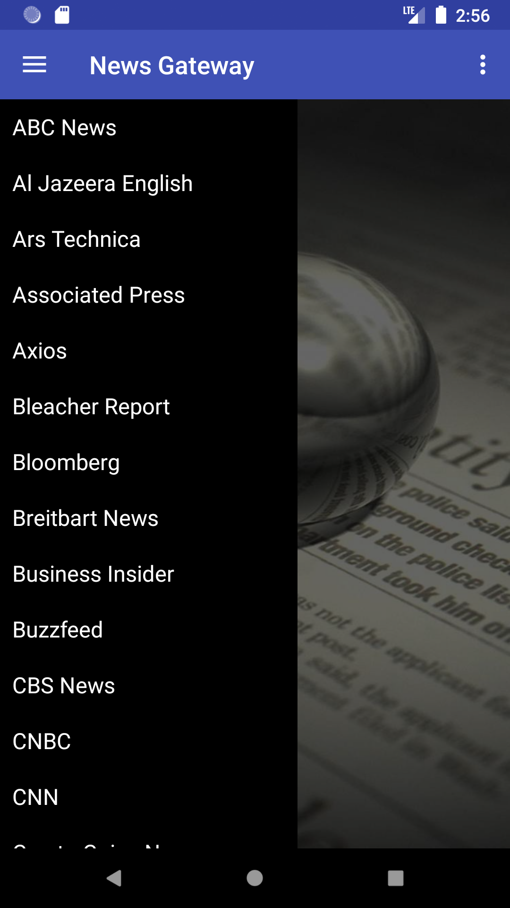
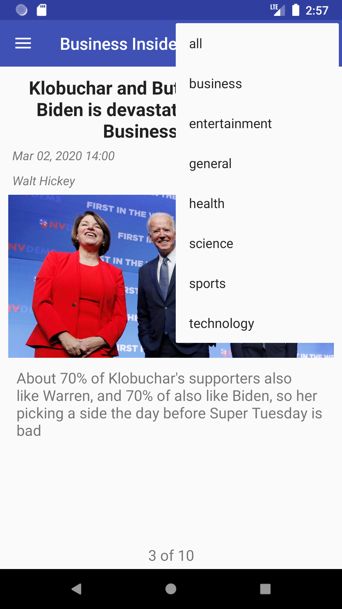

# News Gateway App - JAVA

## Left Drawer Screen

## News Scree (1-10) with option to swipe left or right.

## Option Screen

## Application Features:-

- App displays current news articles from a wide variety of news sources covering a range of news categories.
- Application uses NewsAPI.org to acquire the news sources and news articles.
- On selecting a news source, displays up to 10 top stories from that news source
- Selecting a news category limits the news source choices to only those offering that category of news.
- News articles are viewed by swiping right to read the next article, and left to go back to the previous article
- App Supports both Landscape and Portrait Layout.