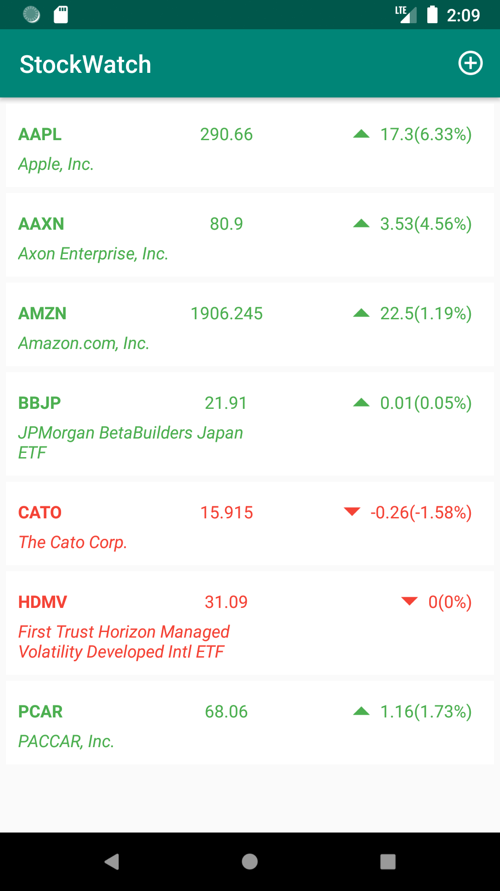

# Stock Watch App - JAVA

## App Features:-

- App allows the user to display a sorted list of selected stocks.
- List entries include the stock symbol (and company name), the current price, the daily price change amount and price percent change.
- Selected stock symbols and the related names is being stored in the device’s SQLite Database.
- A Stock class is being created to represent each individual stock in the application. Required data includes: Stock Symbol (String), Company Name (String), Price (double), Price Change (double), and Change Percentage (double).
- Clicking on a stock opens a browser displaying the Market Watch web page for that stock
- App also includes Swipe-Refresh (pull-down) feature that refreshes stock data.