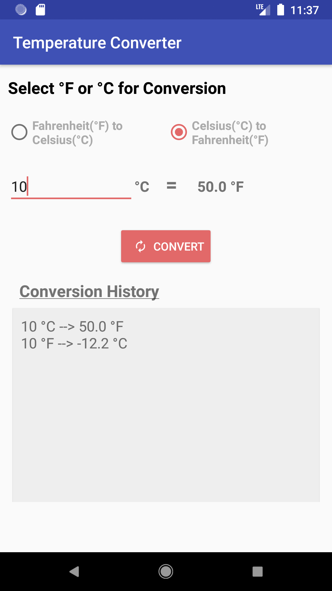

# Temperature Converter - APP (JAVA)

## This App allows user to convert between Fahrenheit and Celsius temperatures.

## Home Screen

## Features 

- The app allows the user to select either Fahrenheit-to-Celsius or Celsius-to-Fahrenheit conversions.
- Formulae being used for conversion:

        F to C: (F – 32.0) / 1.8 
        C to F: (C * 1.8) + 32
        
- The temperature value (the value to be converted) is entered by the user. Only numeric decimal values is allowed.
- Pressing a Convert button generate the converted temperature value and display it on the screen. Moreover all converted values is being displayed out to 1 decimal place only.
- All conversion operations and their results is added to the “history” – a list of converted values. The history of converted values is scrollable.
- The app look and act consistently in either portrait or landscape orientation. No data content is lost upon rotation.
